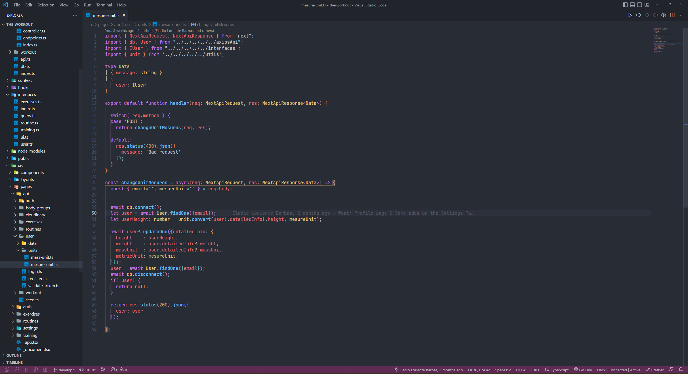

# Configuración VSCode

En el archivo [settings.jsonc](./settings.jsonc) encontrarás la configuración que uso yo en mi VSCode pero antes
de que copies todo el contenido del archivo te explicaré un poco para que sirve cada cosa.

> ⚠️ Importante está configuración se ha hecho teniendo como base el tema [One Dark Pro Mix](https://marketplace.visualstudio.com/items?itemName=zhuangtongfa.Material-theme), además algunas configuraciones no están explicadas debido a que son algo más personas como el `workbench.iconTheme` refiriendose a la extension de iconos, `editor.tabSize` tamaño de tabulaciones en los archivos y `explorer.compactFolders` evitar la configuración predeterminada de carpetas compactas de Visual Studio.
## Variables de configuración

**_Ligaduras y Saltos de linea_** :

Con `editor.wordWrap` podrás activar una configuración evita el scroll lateral en los ficheros de código y así tener todo el código de una manera mas visual.

Con `editor.fontLigatures` podrás hacer que los carácteres de la fuente se unan, solo es un aspecto visual pero da facilidades a la hora de leer según que cosas.

```json
{
    "editor.wordWrap": "on",
    "editor.fontLigatures": true,
}
```

**_Customización de colores_** :

En el apartado de `workbench.colorCustomizations` indicaremos todas las configuraciones que hacen referencia a gestión de colores de Visual Studio Code.

En el apartado de `editor.tokenColorCustomizations` indicaremos todas las configuraciones que hacen referencia a colores de archivos como pueden ser variables, funciones, etc.

Para conocer mejor que variables de configuración podemos encontrar en estos apartados revisar la [documentación oficial de Microsoft](https://code.visualstudio.com/api/references/theme-color).
```json
{
    "workbench.colorCustomizations": {
      "statusBar.noFolderBackground": "#5d2b54",
      "statusBar.background": "#5d2b54",
      "statusBar.foreground": "#c2c2c2",
      "sideBar.foreground": "#e7e7e7",
      "gitDecoration.ignoredResourceForeground": "#e7e7e7",
      "breadcrumb.foreground": "#797979",
      "gitDecoration.modifiedResourceForeground": "#e2ac39",
      "gitDecoration.untrackedResourceForeground": "#74cc59",
      "tab.activeForeground": "#f1f1f1",
      "tab.inactiveForeground": "#868686"
  },
  "editor.tokenColorCustomizations": {
      "strings": "#c2c2c2"
  }
}
```

**_Personalización de fuente_** :

Para la personalización de la fuente en Visual Studio, la cual deberá estar instalada en nuestro sistema previamente, se puede hacer de dos maneras, a través de `File > Preference > Settings` o realizarlo a través del archivo (a veces desde Settings no va muy bien).

Podemos indicarle la fuente del editor y de la terminal con las variables de `terminal.integrated.fontFamily` y `editor.fontFamily`.

```json
{
    "terminal.integrated.fontFamily": "JetBrainsMono NF, monospace",
    "editor.fontFamily": "JetBrainsMono NF , monospace",
}
```

## Otros cambios realizados.

- [Activitus Bar](https://marketplace.visualstudio.com/items?itemName=Gruntfuggly.activitusbar): Dado que me incomoda la barra lateral de actividad uso está extensión que me coloca la barra en la parte inferior de Visual Studio.
